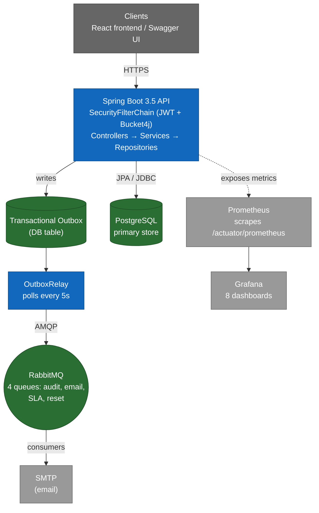
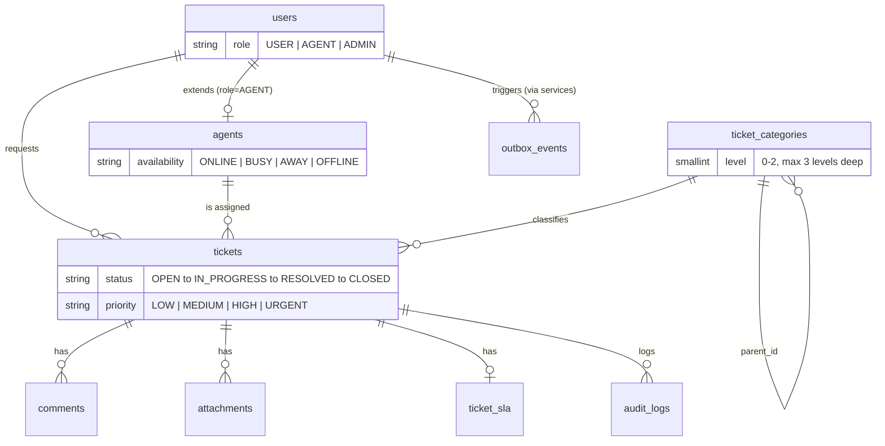
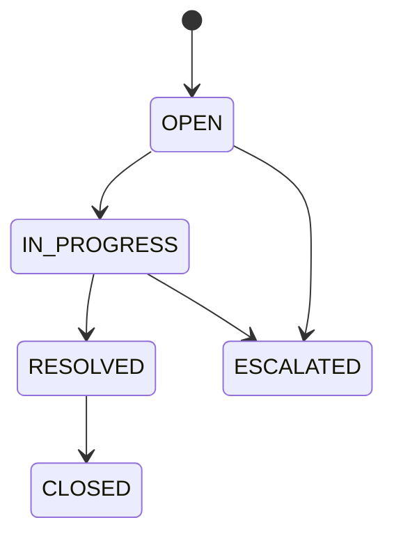
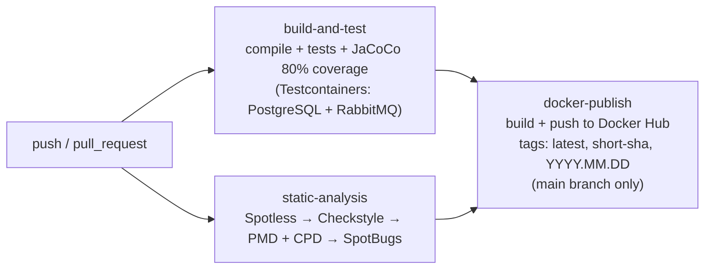
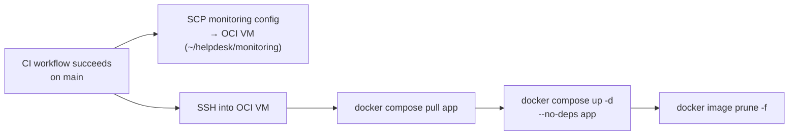

# GovHelpDesk

A production-ready REST API for government support ticket management, built with Spring Boot 3.5 and Java 21.

[](https://github.com/Mosotho888/GovHelp_Desk/actions/workflows/ci.yml)
[](https://adoptium.net)
[](https://spring.io/projects/spring-boot)
[](LICENSE)
[](https://govhelpdesk.sothoman.com)
[](https://api.sothoman.com/swagger-ui.html)

**🔗 Live app:** [govhelpdesk.sothoman.com](https://govhelpdesk.sothoman.com) · **📘 API docs:**
[api.sothoman.com/swagger-ui.html](https://api.sothoman.com/swagger-ui.html)

This repository contains the **backend API** only. The production UI is built and deployed from a companion repository -
see [Frontend](#frontend).

---

## Table of Contents

- [Overview](#overview)
- [Frontend](#frontend)
- [Architecture](#architecture)
- [Tech Stack](#tech-stack)
- [Domain Model](#domain-model)
- [API Reference](#api-reference)
- [Getting Started](#getting-started)
- [Configuration](#configuration)
- [Running with Docker](#running-with-docker)
- [Running Tests](#running-tests)
- [Monitoring](#monitoring)
- [CI/CD Pipeline](#cicd-pipeline)
- [Static Analysis](#static-analysis)
- [Project Structure](#project-structure)

---

## Overview

GovHelpDesk is a multi-role support ticketing system designed for government departments. Citizens submit tickets,
agents work them, and administrators oversee the operation. It's a full-stack, production-deployed portfolio project:
this Spring Boot API on the backend, paired with a dedicated React frontend (see [Frontend](#frontend) below).

### Why this exists

The idea came out of an IT Support Internship at a South African local municipality. There was no system for logging
support calls: when someone called in, the request was captured verbally and tracked informally rather than through a
proper ticketing workflow. GovHelpDesk started as a way to solve that specific, real problem - a structured way to log a
call as a ticket, route it to an agent, and track it through to resolution - and grew into a full production build:
a complete SDLC process, a hardened Spring Boot backend, a React frontend, and a real deployment, built to demonstrate
the same engineering rigor a government IT department's ticketing system would actually need.

Key capabilities:

- **Ticket lifecycle management** - create, assign, update, escalate, resolve, close
- **SLA enforcement** - per-priority deadlines, automated warning and breach detection
- **Role-based access control** - `USER`, `AGENT`, and `ADMIN` roles with endpoint-level enforcement
- **Async notifications** - email notifications via RabbitMQ + transactional outbox pattern
- **Audit trail** - every state change recorded to a queryable audit log
- **Observability** - Prometheus metrics per domain, Grafana dashboards, structured logging

---

## Frontend

The production UI lives in a separate repository:
**[Mosotho888/Helpdesk_Frontend](https://github.com/Mosotho888/Helpdesk_Frontend)** - deployed at
[govhelpdesk.sothoman.com](https://govhelpdesk.sothoman.com).

| Layer            | Technology                                                       |
|------------------|------------------------------------------------------------------|
| Build tool       | Vite                                                             |
| Framework        | React + TypeScript                                               |
| Data fetching    | TanStack Query                                                   |
| Tables           | TanStack Table                                                   |
| UI components    | shadcn/ui                                                        |
| Forms/validation | React Hook Form + Zod                                            |
| Deployment       | Docker, deployed via GitHub Actions CI/CD to the same OCI ARM VM |

It implements the full feature set against this API: authentication, ticket management, comments, attachments, agent
views, user administration, SLA display, and audit logs.

---

## Architecture



This is a simplified overview. The full, versioned architecture - C4 diagrams and the reasoning behind each major
decision - lives under [`docs/architecture/`](docs/architecture):

| Doc                                                    | What it covers                                                                          |
|--------------------------------------------------------|-----------------------------------------------------------------------------------------|
| [`c4-context.md`](docs/architecture/c4-context.md)     | System context: actors (Employee/Agent/Admin), external systems (SMTP, Cloudflare, OCI) |
| [`c4-container.md`](docs/architecture/c4-container.md) | Container-level view: API, PostgreSQL, RabbitMQ, file storage, Prometheus, Grafana      |
| [`c4-component.md`](docs/architecture/c4-component.md) | Component breakdown of the API - domain modules, cross-cutting policies, messaging      |
| [`deployment.md`](docs/architecture/deployment.md)     | Production topology on OCI, and *why* each infra choice was made                        |
| [`decisions.md`](docs/architecture/decisions.md)       | Index of Architecture Decision Records (ADRs) under [`docs/adr/`](docs/adr)             |

### Key design patterns

| Pattern                  | Where used                                                                   | Why                                                                                    |
|--------------------------|------------------------------------------------------------------------------|----------------------------------------------------------------------------------------|
| Transactional Outbox     | `OutboxEvent` table + `OutboxRelay`                                          | Guarantees at-least-once message delivery without distributed transactions             |
| Repository per aggregate | `TicketRepository`, `CommentRepository`, etc.                                | Clean domain boundaries, testable in isolation                                         |
| DTO separation           | `*Request` / `*Response` / `*Message`                                        | Entities never leave the service layer                                                 |
| Domain events            | `TicketEventDispatcher`                                                      | Decouples ticket state changes from audit/notification side effects                    |
| Policy objects           | `CommentAccessPolicy`, `AttachmentValidator`, `TicketStatusTransitionPolicy` | Authorization/validation rules live in one testable place, not scattered service `if`s |
| Per-domain metrics       | `TicketMetrics`, `AuthMetrics`, etc.                                         | Each domain owns its observability; no shared God Object                               |

---

## Tech Stack

| Layer            | Technology                                     |
|------------------|------------------------------------------------|
| Language         | Java 21                                        |
| Framework        | Spring Boot 3.5                                |
| Security         | Spring Security 6, JWT (JJWT 0.12.6)           |
| Persistence      | Spring Data JPA, Hibernate 6, PostgreSQL 18    |
| Migrations       | Flyway (7 migration scripts)                   |
| Messaging        | Spring AMQP, RabbitMQ 3                        |
| Email            | Spring Mail + Thymeleaf templates              |
| API Docs         | SpringDoc OpenAPI 3 (Swagger UI)               |
| Mapping          | MapStruct 1.5.5                                |
| Boilerplate      | Lombok 1.18.30                                 |
| Rate Limiting    | Bucket4j 8.10.1 + Caffeine cache               |
| Monitoring       | Micrometer, Prometheus, Grafana                |
| Containerisation | Docker, Docker Compose                         |
| Testing          | JUnit 5, Mockito, Testcontainers, Rest-Assured |
| CI               | GitHub Actions                                 |
| Static Analysis  | Checkstyle, SpotBugs, PMD, Spotless            |

---

## Domain Model



Full field-level ER diagram: [`docs/database/database.md`](docs/database/database.md). Not pictured above (no direct FK
to a ticket, but part of the same schema): `refresh_tokens` (JWT refresh token store), `password_reset_tokens`
(OTP-based reset flow), `sla_policies` (per-priority SLA configuration).

### Ticket status flow



---

## API Reference

All endpoints are prefixed with `/v1`. Authentication is JWT Bearer token from `/v1/auth/login`.

Interactive documentation is available at `http://localhost:8080/swagger-ui.html` locally, or
[api.sothoman.com/swagger-ui.html](https://api.sothoman.com/swagger-ui.html) in production. For the authoritative,
source-verified reference (kept in sync with the controllers directly), see
[`docs/api/api-reference.md`](docs/api/api-reference.md).

### Authentication - `/v1/auth`

| Method | Path                      | Role          | Description                                   |
|--------|---------------------------|---------------|-----------------------------------------------|
| `POST` | `/login`                  | Public        | Authenticate, receive access + refresh tokens |
| `POST` | `/refresh`                | Public        | Exchange refresh token for new access token   |
| `POST` | `/logout`                 | Authenticated | Revoke all refresh tokens                     |
| `POST` | `/password-reset/request` | Public        | Request OTP via email                         |
| `POST` | `/password-reset/confirm` | Public        | Confirm OTP, set new password                 |

### Tickets - `/v1/tickets`

| Method   | Path    | Role   | Description                                                                                |
|----------|---------|--------|----------------------------------------------------------------------------------------------|
| `POST`   | `/`     | USER+  | Create a new ticket                                                                          |
| `GET`    | `/`     | USER+  | List tickets (USERs see only their own); filter by `categoryId` (+ `includeDescendants`)     |
| `GET`    | `/{id}` | USER+  | Get ticket by ID                                                                             |
| `PATCH`  | `/{id}` | AGENT+ | Update status, assignee, priority, or category                                              |
| `DELETE` | `/{id}` | ADMIN  | Delete ticket                                                                                |

### Ticket Categories - `/v1/categories`

| Method   | Path    | Role   | Description                                              |
|----------|---------|--------|-------------------------------------------------------------|
| `GET`    | `/`     | USER+  | Get the full category tree                                 |
| `GET`    | `/{id}` | USER+  | Get a single category                                       |
| `POST`   | `/`     | ADMIN  | Create a category or subcategory (max 3 levels deep)        |
| `PATCH`  | `/{id}` | ADMIN  | Rename, re-route (default department), or (de)activate     |
| `DELETE` | `/{id}` | ADMIN  | Soft-deactivate a category                                  |

### Comments - `/v1`

| Method   | Path                     | Role         | Description                                     |
|----------|--------------------------|--------------|-------------------------------------------------|
| `POST`   | `/tickets/{id}/comments` | USER+        | Add comment or internal note                    |
| `GET`    | `/tickets/{id}/comments` | USER+        | List comments (internal notes filtered by role) |
| `POST`   | `/comments/{id}/replies` | USER+        | Reply to a comment                              |
| `GET`    | `/comments/{id}/replies` | USER+        | List replies                                    |
| `PUT`    | `/comments/{id}`         | Author/ADMIN | Edit comment                                    |
| `DELETE` | `/comments/{id}`         | Author/ADMIN | Delete comment                                  |

### Attachments - `/v1`

| Method   | Path                        | Role        | Description                               |
|----------|-----------------------------|-------------|-------------------------------------------|
| `POST`   | `/tickets/{id}/attachments` | USER+       | Upload files (max 20MB each, 100MB total) |
| `GET`    | `/tickets/{id}/attachments` | USER+       | List attachments for ticket               |
| `GET`    | `/attachments/{id}`         | USER+       | Download attachment                       |
| `DELETE` | `/attachments/{id}`         | Owner/ADMIN | Delete attachment                         |

### Agents - `/v1/agents`

| Method  | Path          | Role         | Description                       |
|---------|---------------|--------------|-----------------------------------|
| `POST`  | `/`           | ADMIN        | Register a user as an agent       |
| `GET`   | `/`           | AGENT, ADMIN | List all agents                   |
| `GET`   | `/{id}`       | AGENT, ADMIN | Get agent by ID                   |
| `PATCH` | `/{id}`       | AGENT, ADMIN | Update availability or department |
| `GET`   | `/{id}/stats` | ADMIN        | Agent performance statistics      |

### Users - `/v1/users`

| Method  | Path           | Role          | Description         |
|---------|----------------|---------------|---------------------|
| `POST`  | `/`            | ADMIN         | Create user         |
| `GET`   | `/`            | ADMIN         | List all users      |
| `GET`   | `/me`          | Authenticated | Get own profile     |
| `GET`   | `/{id}`        | ADMIN or self | Get user by ID      |
| `PUT`   | `/{id}`        | ADMIN or self | Full update         |
| `PATCH` | `/me/password` | Authenticated | Change own password |

### Admin - `/v1/admin/users`

| Method   | Path               | Role  | Description     |
|----------|--------------------|-------|-----------------|
| `DELETE` | `/{id}`            | ADMIN | Deactivate user |
| `POST`   | `/{id}/reactivate` | ADMIN | Reactivate user |
| `PATCH`  | `/{id}/role`       | ADMIN | Change role     |
| `PATCH`  | `/{id}/password`   | ADMIN | Reset password  |

### Audit Log - `/v1/audit`

| Method | Path               | Role   | Description                       |
|--------|--------------------|--------|-----------------------------------|
| `GET`  | `/tickets/{id}`    | AGENT+ | Audit history for a ticket        |
| `GET`  | `/users/{id}`      | ADMIN  | Audit history for a user          |
| `GET`  | `/agents/{id}`     | ADMIN  | Audit history for an agent        |
| `GET`  | `/auth`            | ADMIN  | Auth event log (logins, resets)   |
| `GET`  | `/actor/{actorId}` | ADMIN  | All actions by a specific user    |
| `GET`  | `/action/{action}` | ADMIN  | All events of a given action type |

### SLA - `/v1/tickets/{id}/sla`

| Method | Path | Role   | Description                                        |
|--------|------|--------|----------------------------------------------------|
| `GET`  | `/`  | AGENT+ | SLA record for a ticket (deadlines, breach status) |

---

## Getting Started

### Prerequisites

- Java 21+
- Maven 3.9+
- Docker and Docker Compose

### 1. Clone the repository

```bash
git clone https://github.com/Mosotho888/GovHelp_Desk.git
cd GovHelp_Desk/helpdesk
```

### 2. Create your `.env` file

Create a `.env` file in `helpdesk/` with the variables listed in [Configuration](#configuration) below (there is
currently no committed `.env.example` template — copy the required-variables table as a starting point).

### 3. Start infrastructure

```bash
docker compose up -d db rabbitmq
```

### 4. Run the application

```bash
./mvnw spring-boot:run
```

The API is available at `http://localhost:8080`. Swagger UI is at `http://localhost:8080/swagger-ui.html`.

---

## Configuration

All configuration is driven by environment variables. Copy `.env.example` to `.env` and set the following:

### Required

| Variable               | Description                   | Example                    |
|------------------------|-------------------------------|----------------------------|
| `PG_HOST`              | PostgreSQL host               | `localhost`                |
| `PG_PORT`              | PostgreSQL port               | `5432`                     |
| `PG_USER`              | Database user                 | `helpdesk_user`            |
| `PG_PASSWORD`          | Database password             | `changeme`                 |
| `POSTGRES_DB`          | Database name                 | `helpdesk_db`              |
| `JWT_SECRET_KEY`       | HS512 secret, min 64 chars    | `your-very-long-secret...` |
| `JWT_VALIDITY`         | Access token TTL (ms)         | `900000` (15 min)          |
| `JWT_REFRESH_VALIDITY` | Refresh token TTL (ms)        | `604800000` (7 days)       |
| `MAIL_HOST`            | SMTP host                     | `smtp.gmail.com`           |
| `MAIL_PORT`            | SMTP port                     | `587`                      |
| `MAIL_USERNAME`        | SMTP username / email         | `noreply@gov.za`           |
| `MAIL_PASSWORD`        | SMTP password or app password | `your-app-password`        |
| `RABBITMQ_USERNAME`    | RabbitMQ username             | `admin`                    |
| `RABBITMQ_PASSWORD`    | RabbitMQ password             | `changeme`                 |
| `RABBITMQ_PORT`        | RabbitMQ AMQP port            | `5672`                     |

### Optional (have defaults)

| Variable                              | Default       | Description                                        |
|---------------------------------------|---------------|----------------------------------------------------|
| `UPLOAD_PATH`                         | `./uploads`   | Filesystem path for attachments                    |
| `RATE_LIMIT_CAPACITY_UNAUTHENTICATED` | `100`         | Requests/hour for anonymous callers                |
| `RATE_LIMIT_CAPACITY_USER`            | `1000`        | Requests/hour for USER role                        |
| `RATE_LIMIT_CAPACITY_AGENT`           | `5000`        | Requests/hour for AGENT role                       |
| `RATE_LIMIT_CAPACITY_ADMIN`           | `10000`       | Requests/hour for ADMIN role                       |
| `OUTBOX_POLL_INTERVAL`                | `PT5S`        | How often OutboxRelay polls (ISO 8601 duration)    |
| `OUTBOX_PURGE_CRON`                   | `0 0 3 * * *` | Cron for purging old processed events (3 AM daily) |
| `SLA_MONITOR_INTERVAL`                | `PT5M`        | How often SlaBreachMonitor runs                    |
| `MIN_CONCURRENCY`                     | `1`           | RabbitMQ consumer thread count                     |
| `HIBERNATE_DIALECT`                   | —             | Set to `org.hibernate.dialect.PostgreSQLDialect`   |

---

## Running with Docker

The full stack (app + PostgreSQL + RabbitMQ + Prometheus + Grafana) runs with Docker Compose.

```bash
# Start everything
docker compose up -d

# Start only infrastructure (run the app locally via mvnw)
docker compose up -d db rabbitmq

# With monitoring stack
docker compose up -d db rabbitmq prometheus grafana

# View logs
docker compose logs -f spring-boot-app

# Stop and remove containers
docker compose down

# Stop and remove containers + volumes (clean slate)
docker compose down -v
```

### Service ports

| Service             | Port    | URL                                                  |
|---------------------|---------|------------------------------------------------------|
| Spring Boot API     | `8080`  | `http://localhost:8080`                              |
| Swagger UI          | `8080`  | `http://localhost:8080/swagger-ui.html`              |
| PostgreSQL          | `5433`  | `localhost:5433` (mapped from 5432 inside container) |
| RabbitMQ AMQP       | `5672`  | `localhost:5672`                                     |
| RabbitMQ Management | `15672` | `http://localhost:15672`                             |
| Prometheus          | `9090`  | `http://localhost:9090`                              |
| Grafana             | `3000`  | `http://localhost:3000` (admin / admin)              |

---

## Running Tests

```bash
# All tests (unit + integration) with coverage check
./mvnw verify

# Unit tests only (no Testcontainers, fast)
./mvnw test

# Integration tests only
./mvnw verify -Dit.test="*IT"

# Skip tests (build only)
./mvnw package -DskipTests
```

Tests use **Testcontainers** - PostgreSQL and RabbitMQ containers start automatically during the test run. Docker must
be running. No manual database setup is required.

Coverage report is generated at `target/site/jacoco/index.html` after `./mvnw verify`. The minimum required line
coverage is **80%** - the build fails if it drops below this.

---

## Monitoring

Prometheus and Grafana are fully provisioned. After `docker compose up -d prometheus grafana`:

1. Open Grafana at `http://localhost:3000` (admin / admin)
2. Navigate to **Dashboards → GovHelpDesk** folder
3. Eight dashboards are pre-loaded:

| Dashboard             | What it shows                                                    |
|-----------------------|------------------------------------------------------------------|
| **Tickets**           | Create/resolve/close/escalate rates, resolution time p50/p95/p99 |
| **Comments**          | Public vs internal note volume, edit/delete rates                |
| **Attachments**       | Upload/download rates, file size distribution                    |
| **Agents**            | Registrations, availability changes, department reassignments    |
| **SLA**               | Response/resolution breach and warning rates, 24h window         |
| **Outbox Relay**      | Pending backlog gauge, publish/failure/dead-letter rates         |
| **Auth and Security** | Login success/failure ratio, token lifecycle, brute-force signal |
| **Notifications**     | Email ACK/NACK/DLQ rates, audit consumer throughput              |

### Custom metrics

All custom metrics use the `helpdesk.*` prefix. Micrometer auto-instruments the rest (`http.*`, `jvm.*`, `hikaricp.*`,
etc.).

Each domain owns its metrics through a dedicated `@Component` bean:

```
TicketMetrics       → helpdesk.ticket.*
CommentMetrics      → helpdesk.comment.*
AttachmentMetrics   → helpdesk.attachment.*
AgentMetrics        → helpdesk.agent.*
SlaMetrics          → helpdesk.sla.*
OutboxMetrics       → helpdesk.outbox.*
AuthMetrics         → helpdesk.auth.*
NotificationMetrics → helpdesk.notification.*
```

Prometheus scrapes `/actuator/prometheus` every 15 seconds.

---

## CI/CD Pipeline

### CI - `.github/workflows/ci.yml`

Every push triggers the GitHub Actions CI pipeline.



### CD - `.github/workflows/cd.yml`

On successful CI against `main`, the CD workflow deploys straight to production:



This deploys only the `app` service - the database, RabbitMQ, Prometheus, and Grafana containers are left running
untouched. The live API is served at [api.sothoman.com](https://api.sothoman.com) from an OCI Free Tier ARM VM (Ubuntu
22.04, Johannesburg), fronted by Cloudflare DNS with Full (Strict) SSL.

`railway.json` is kept in the repo as a documented fallback deploy target (a quick demo without provisioning a VM) - it
is not the primary target. See [ADR 0004](docs/adr/0004-oci-arm-free-tier-deployment.md) for why OCI was chosen instead.

### Required GitHub repository secrets

Go to **Settings → Secrets and variables → Actions** and add:

| Secret                | Description                                           | Used by |
|-----------------------|-------------------------------------------------------|---------|
| `DOCKERHUB_USERNAME`  | Your Docker Hub username                              | CI      |
| `DOCKERHUB_TOKEN`     | Docker Hub access token (Account Settings → Security) | CI      |
| `OCI_VM_IP`           | Public IP of the OCI deployment VM                    | CD      |
| `OCI_SSH_PRIVATE_KEY` | SSH private key with access to the OCI VM             | CD      |

---

## Static Analysis

Four tools run on every push. All configuration lives under `config/`.

### Spotless - formatting

Enforces consistent formatting using the Eclipse formatter engine.

```bash
./mvnw spotless:check   # check (used in CI)
./mvnw spotless:apply   # auto-fix (run locally before committing)
```

**Always run `./mvnw spotless:apply` before pushing.** CI runs `check` only - it will fail if any file is unformatted.

Config: `config/spotless/eclipse-formatter.xml`

### Checkstyle - source style

Enforces naming conventions, import order, line length (120), brace placement, and magic number rules.

```bash
./mvnw checkstyle:check       # fail on violations
./mvnw checkstyle:checkstyle  # generate HTML report
```

Config: `config/checkstyle/checkstyle.xml`

> **Note:** Existing wildcard imports (`import lombok.*`) are flagged by Checkstyle.
> Fix with **IntelliJ → Code → Optimize Imports** on each affected file.

### PMD - code quality

Detects code complexity, dead code, bad patterns, and copy-paste duplication (CPD).

```bash
./mvnw pmd:check      # PMD violations
./mvnw pmd:cpd-check  # copy-paste violations
./mvnw pmd:pmd        # generate HTML report
```

Config: `config/pmd/pmd-ruleset.xml`

### SpotBugs - bytecode bugs

Finds null dereferences, resource leaks, unsafe synchronisation, and dangerous API usage by analysing compiled bytecode.

```bash
./mvnw spotbugs:check  # fail on findings
./mvnw spotbugs:gui    # open interactive GUI report
```

Config: `config/spotbugs/exclude.xml` (false-positive suppressions for Lombok/MapStruct/Spring)

---

## Project Structure

```
src/
├── main/
│   ├── java/za/gov/helpdesk/
│   │   ├── HelpdeskApplication.java
│   │   ├── agent/              # Agent profiles and availability
│   │   ├── attachment/         # File upload/download
│   │   ├── auditlog/           # Audit trail (consumer + query API)
│   │   ├── auth/               # JWT auth, refresh tokens, password reset
|   |   |── category/           # Threaded categories (Level 2)
│   │   ├── comment/            # Threaded comments and internal notes
│   │   ├── config/
│   │   │   ├── metrics/        # Per-domain Micrometer beans
│   │   │   ├── messaging/      # RabbitMQ topology (exchanges, queues)
│   │   │   └── security/       # SecurityFilterChain, RateLimitingFilter
│   │   ├── exception/          # Global exception handler, custom exceptions
│   │   ├── notification/       # Email consumers and SMTP service
│   │   ├── outbox/             # Transactional outbox (model, relay, repo)
│   │   ├── sla/                # SLA policies, per-ticket SLA, breach monitor
│   │   ├── ticket/             # Core ticket domain
│   │   └── users/              # User management
│   └── resources/
│       ├── application.properties
│       ├── db/migration/       # Flyway scripts V1–V7
│       └── templates/          # Thymeleaf email templates
├── test/
│   ├── java/za/gov/helpdesk/
│   │   ├── integration/        # Testcontainers integration tests
│   │   └── unit/               # Mockito unit tests per service
│   └── resources/
│       └── application-test.properties
config/
├── checkstyle/checkstyle.xml
├── spotbugs/exclude.xml
├── pmd/pmd-ruleset.xml
└── spotless/eclipse-formatter.xml
monitoring/
├── prometheus/prometheus.yml
└── grafana/
    ├── provisioning/
    │   ├── datasources/
    │   └── dashboards/
    └── dashboards/             # 8 JSON dashboard definitions
.github/
└── workflows/
    └── ci.yml
Dockerfile                      # Multi-stage: eclipse-temurin:17-jdk → 17-jre
docker-compose.yml
```

## Limitations and Future Enhancements

GovHelpDesk currently focuses on providing the core functionality required for an IT department Help Desk. While it
supports secure authentication, ticket lifecycle management, SLA monitoring, audit logging, notifications, and
observability, several enterprise features are intentionally reserved for future releases.

### Planned Enhancements

- **Asset Management**
    - Register and manage IT assets (laptops, desktops, printers, monitors, networking equipment, and software
      licenses).
    - Associate support tickets with specific assets to provide technicians with device history, warranty information,
      and ownership details.

- **Operational Dashboards**
    - Provide dashboards for agents and administrators showing ticket volumes, SLA compliance, workload distribution,
      resolution times, and performance metrics.

- **Knowledge Base**
    - Create searchable documentation containing troubleshooting guides, FAQs, and standard operating procedures to
      encourage self-service and reduce repetitive support requests.

- **Automation Rules**
    - Trigger notifications, escalations, and SLA-based workflows without manual intervention, building on the
      category-based auto-assignment already in place (see [
      `docs/adr/0006-hierarchical-ticket-categories.md`](docs/adr/0006-hierarchical-ticket-categories.md)).

- **Saved Replies**
    - Allow agents to use predefined response templates for common IT support scenarios, improving consistency and
      reducing response times.

- **Customer Satisfaction (CSAT)**
    - Collect user feedback after ticket resolution to measure service quality and support continuous improvement.

These enhancements are planned to extend GovHelpDesk from a production-ready IT Help Desk into a more comprehensive IT
Service Management (ITSM) platform while maintaining a modular and scalable architecture.