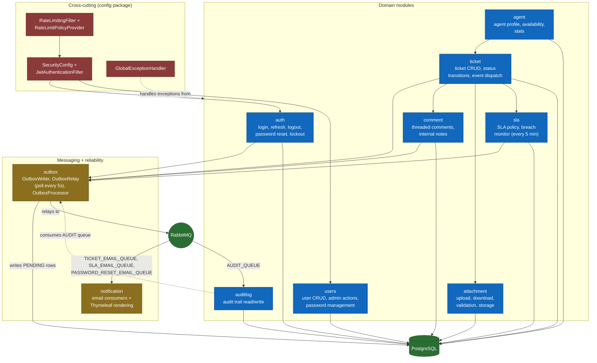

# C4 Model — Level 3: Components (API container)

This zooms into the **API** container from [`c4-container.md`](c4-container.md) to show its
internal module structure. GovHelpDesk is organised as a modular monolith: each business
domain is a self-contained Java package under `za.gov.helpdesk.<domain>` with its own
`controller/`, `dto/`, `mapper/`, `model/`, `repository/`, and `service/` sub-packages.

## Key components and their single responsibility

| Component | Package | Responsibility |
|---|---|---|
| `JwtAuthenticationFilter` / `JwtService` | `auth.jwt` | Parses and validates bearer tokens once per request; issues access/refresh tokens |
| `LoginLockoutService` | `auth.policy` | Tracks failed login attempts and locks accounts after the configured threshold |
| `TicketEventDispatcher` | `ticket.event` | Decouples ticket state changes from their audit/notification side effects |
| `TicketStatusTransitionPolicy` | `ticket.policy` | Validates that a requested status change is a legal transition |
| `TicketUpdateCoordinator` | `ticket.service.impl` | Orchestrates multi-field ticket updates (status, assignee, priority) as one cohesive operation |
| `CommentAccessPolicy` | `comment.policy` | Enforces the author-or-admin, 15-minute edit window rule for comment mutation |
| `AttachmentValidator` | `attachment.policy` | Enforces file count, size, and MIME-type limits before storage |
| `FileStorageServiceImpl` | `attachment.service.storage` | Normalises and containment-checks the destination path to prevent path traversal |
| `SlaBreachMonitor` | `sla.schedular` | `@Scheduled` job (every 5 minutes) that flags response/resolution breaches |
| `BusinessHoursCalculator` | `sla.service` | Computes SLA due dates against business-hours logic |
| `OutboxWriter` / `OutboxRelay` / `OutboxProcessor` | `outbox` | Implements the transactional outbox pattern — see [ADR 0001](../adr/0001-transactional-outbox-pattern.md) |
| `RateLimitingFilter` / `RateLimitPolicyProvider` | `config.security` | Token-bucket rate limiting, capacity resolved by authenticated role |
| `GlobalExceptionHandler` | `exception.global` | Central `@ControllerAdvice` translating domain exceptions to a consistent `ApiErrorResponse` |

## Design patterns in use

| Pattern | Where | Why |
|---|---|---|
| Transactional Outbox | `OutboxEvent` + `OutboxRelay` | At-least-once delivery to RabbitMQ without distributed transactions |
| Repository per aggregate | `TicketRepository`, `CommentRepository`, etc. | Clean domain boundaries, independently testable |
| DTO separation | `*Request` / `*Response` / `*Message` | Entities never cross the service boundary |
| Domain events | `TicketEventDispatcher` | Decouples state changes from audit/notification side effects |
| Policy objects | `CommentAccessPolicy`, `AttachmentValidator`, `TicketStatusTransitionPolicy` | Authorization/validation rules live in one testable place instead of scattered service `if`s |
| Per-domain metrics | `TicketMetrics`, `AuthMetrics`, etc. | Each domain owns its own observability |
