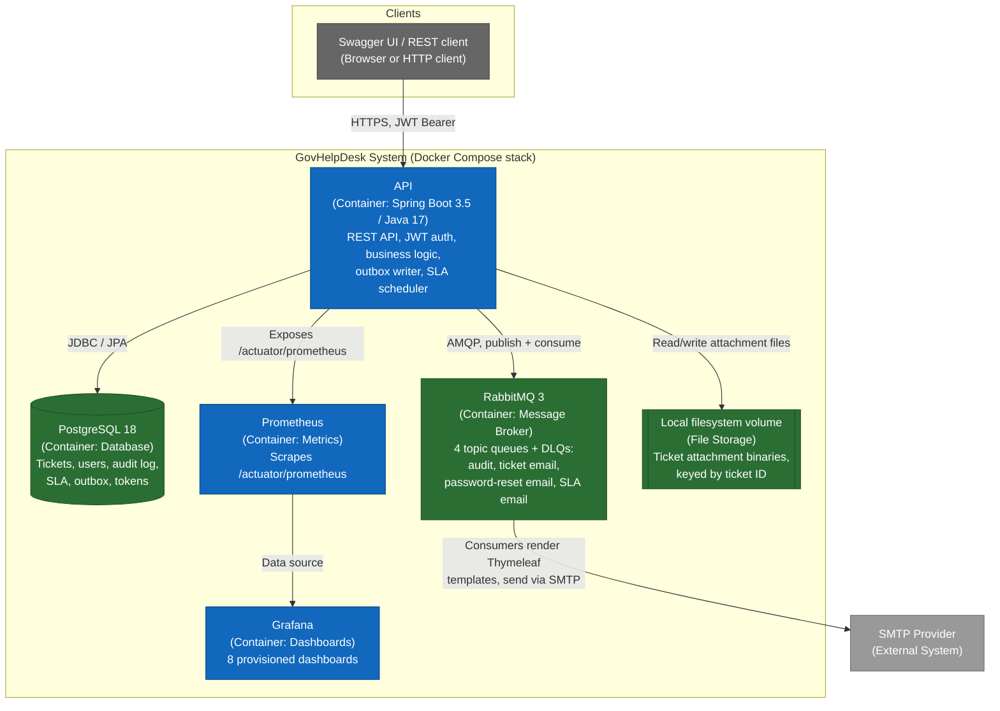

# C4 Model - Level 2: Containers

This zooms into the GovHelpDesk system boundary from
[`c4-context.md`](c4-context.md) to show the deployable containers and how they communicate. See [
`c4-component.md`](c4-component.md) for the breakdown of the API container itself.

## Containers

| Container    | Technology                                        | Responsibility                                                                                                                                                 |
|--------------|---------------------------------------------------|----------------------------------------------------------------------------------------------------------------------------------------------------------------|
| API          | Spring Boot 3.5, Java 17                          | Serves all `/v1/*` REST endpoints, enforces JWT auth + RBAC, runs the SLA breach scheduler and outbox relay                                                    |
| PostgreSQL   | PostgreSQL 18                                     | System of record — users, agents, tickets, comments, attachments metadata, audit log, SLA policies/state, refresh tokens, password-reset tokens, outbox events |
| RabbitMQ     | RabbitMQ 3 (management image)                     | Durable delivery of audit, ticket-email, password-reset-email, and SLA-email messages; each queue has a matching dead-letter queue                             |
| File storage | Docker named volume mounted at `/opt/app/uploads` | Binary storage for ticket attachments, organised per `ticket-{id}` directory                                                                                   |
| Prometheus   | `prom/prometheus`                                 | Scrapes the API's `/actuator/prometheus` endpoint                                                                                                              |
| Grafana      | `grafana/grafana:10.4.3`                          | Dashboards over the Prometheus data source                                                                                                                     |

## Communication

- **Client → API**: HTTPS, JSON, `Authorization: Bearer <JWT>` for all endpoints except
  `/v1/auth/**`, `/v1/health`, and the Swagger/OpenAPI paths.
- **API → PostgreSQL**: Spring Data JPA for transactional aggregate access, plus a JDBC-based reporting repository
  (`TicketJdbcRepository`, `ReportJdbcRepository`) for query-heavy reads that don't map cleanly to the JPA aggregate
  model.
- **API → RabbitMQ**: never a direct synchronous publish from request threads. All cross-cutting side effects (audit
  entries, notification emails) are written to the
  `outbox_events` table in the same transaction as the business change, then relayed to RabbitMQ by a scheduled
  `OutboxRelay` poller - see
  [ADR 0001](../adr/0001-transactional-outbox-pattern.md).
- **API → Filesystem**: attachment binaries are written under a normalised, containment-checked path to prevent path
  traversal - see [`docs/security/README.md`](../security/security-model.md).
- **API → Prometheus**: pull-based scraping, not push.

## Deployment container mapping

In production (`../../helpdesk/docker-compose.yml`), each container above maps 1:1 to a Docker Compose service (`app`,
`db`,
`rabbitmq`, `prometheus`, `grafana`), all attached to the
`spring-boot-api-network` bridge network, running on a single OCI Free Tier ARM VM - see
[`deployment.md`](deployment.md) for the full picture.
