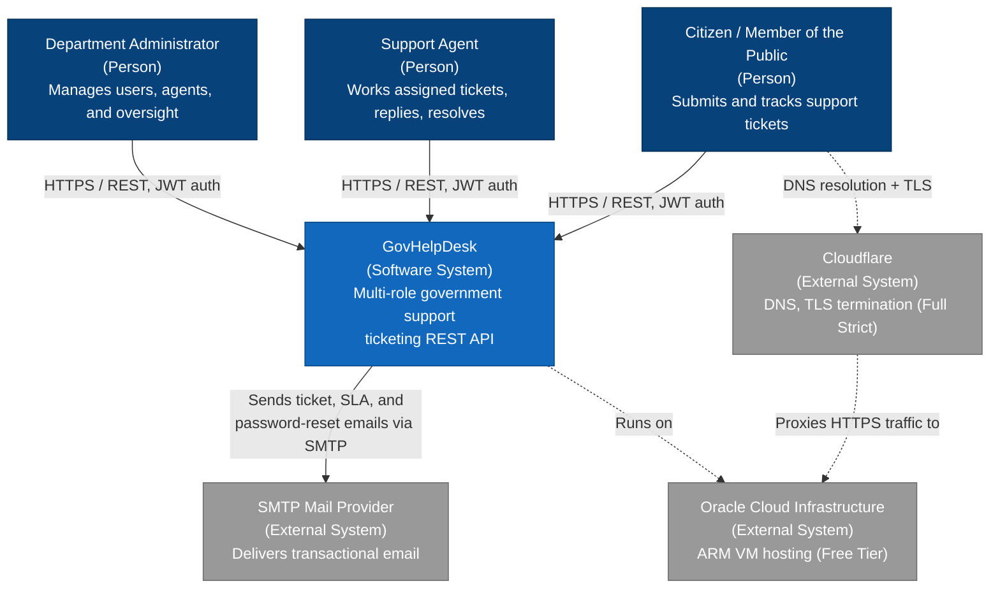

# C4 Model — Level 1: System Context

This diagram shows GovHelpDesk as a single black-box system, its users, and the external
systems it depends on. See [`docs/architecture/c4-container.md`](c4-container.md) for the
next level of detail.

## Actors

| Actor | Role | What they do |
|---|---|---|
| Citizen | `USER` | Creates tickets, comments on their own tickets, uploads attachments, tracks status |
| Support Agent | `AGENT` | Views and works assigned/queued tickets, replies (including internal notes), updates status/priority, views SLA state |
| Department Administrator | `ADMIN` | Full oversight: manages users and agents, deletes tickets, views audit logs, unlocks accounts, resets passwords |

## External systems

| System | Purpose | Integration |
|---|---|---|
| SMTP mail provider | Delivers ticket lifecycle, SLA warning/breach, and OTP password-reset emails | Spring Mail, rendered from Thymeleaf templates, published via the transactional outbox to RabbitMQ, consumed asynchronously |
| Cloudflare | DNS + TLS termination in front of the production VM | Full (Strict) SSL mode between Cloudflare and the origin |
| Oracle Cloud Infrastructure | Hosts the production deployment | Free Tier ARM (Ampere) VM, Ubuntu 22.04, Johannesburg region |

## Not shown

GovHelpDesk has no browser-based frontend at this stage of the project. Interactive API
exploration and testing is done through the built-in Swagger UI, which is considered
sufficient for a backend-focused portfolio project (see
[ADR 0004](../adr/0004-oci-arm-free-tier-deployment.md) for the deployment rationale).
