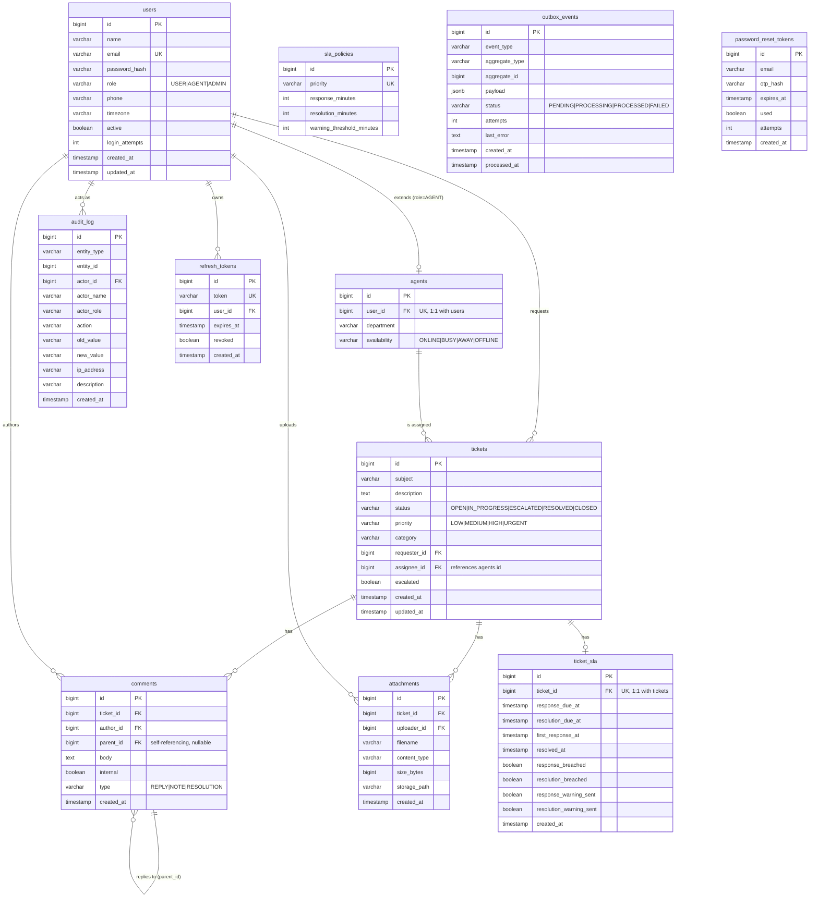

# Database

PostgreSQL 18 is the system of record. Schema is managed entirely by Flyway migrations under
`helpdesk/src/main/resources/db/migration` — Hibernate's DDL auto-generation is disabled in
production (`SPRING_JPA_HIBERNATE_DDL_AUTO=validate`), so the migrations are the single
source of truth for schema state.

## Entity-relationship diagram

## Table notes

### `users`
System-wide identity table for all three roles. `role` is constrained to
`USER | AGENT | ADMIN` at the database level (`CHECK` constraint), not just in application
code. `login_attempts` backs the account-lockout mechanism — see
[`docs/security/README.md`](../security/README.md#account-lockout).

### `agents`
A strict 1:1 extension of `users` for rows with `role = AGENT` (`user_id` is `UNIQUE`), rather
than a separate identity. `availability` drives ticket assignment/routing decisions.

### `tickets`
The core aggregate. `assignee_id` references `agents.id` (not `users.id`) since only agents
can be assigned. `status` and `priority` are both database-level `CHECK` constrained.
Indexes support the three most common access patterns: status-ordered listing
(`idx_tickets_status`), a requester's own tickets (`idx_tickets_requester`), and an agent's
assigned queue by status (`idx_tickets_assignee`).

### `comments`
Threaded via a self-referencing `parent_id`. `type` distinguishes plain `REPLY`s from
`internal`-only `NOTE`s (visible to agents/admins but not the requesting citizen) and
`RESOLUTION` comments.

### `attachments`
Metadata only — binary content lives on the filesystem (or a mounted volume in production)
under `storage_path`, keyed per ticket. See
[`docs/security/README.md`](../security/README.md#file-upload-safety) for how `storage_path`
is validated to prevent path traversal.

### `audit_log`
Originally a ticket-only log; refactored in `V3__refactor_audit_log.sql` into a generic
entity audit trail (`entity_type` + `entity_id` rather than a hardcoded `ticket_id`), with
`actor_name`/`actor_role` captured at write time (denormalised, so the audit trail remains
accurate even if a user's name or role later changes) plus `ip_address` for security-relevant
events like login and lockout.

### `sla_policies` / `ticket_sla`
`sla_policies` is a small, seeded configuration table (one row per priority). `ticket_sla` is
the per-ticket runtime state, created when a ticket is opened and updated as
`SlaBreachMonitor` runs its 5-minute sweep, flipping `response_breached` /
`resolution_breached` and the corresponding `*_warning_sent` flags to avoid duplicate
notifications.

### `outbox_events`
Backs the transactional outbox pattern — see
[ADR 0001](../adr/0001-transactional-outbox-pattern.md). The partial index
`idx_outbox_status_created` (`WHERE status = 'PENDING'`) keeps the relay's polling query fast
even as processed rows accumulate, since it only indexes the rows the poller actually needs.

### `refresh_tokens` / `password_reset_tokens`
Support the two pieces of server-side auth state described in
[ADR 0003](../adr/0003-jwt-stateless-authentication.md): revocable refresh tokens, and
short-lived OTP hashes (never the raw OTP) for password reset.

## Migration history

| Version | File | Summary |
|---|---|---|
| V1 | `V1__helpdesk_schema.sql` | Core schema: `users`, `agents`, `tickets`, `comments`, `attachments`, original `audit_log` |
| V2 | `V2__seed_data.sql` | Seed data for local/demo environments |
| V3 | `V3__refactor_audit_log.sql` | Generalised `audit_log` from ticket-only to entity-generic, added actor/IP metadata |
| V4 | `V4__create_refresh_tokens.sql` | Added `refresh_tokens` |
| V5 | `V5__create_password_reset_tokens.sql` | Added `password_reset_tokens` |
| V6 | `V6__create_sla_tables.sql` | Added `sla_policies` (seeded) and `ticket_sla` |
| V7 | `V7__create_outbox_events.sql` | Added `outbox_events` for the transactional outbox pattern |

New migrations should always be additive and forward-only (Flyway's model) — never edit a
committed migration file once it has run against any shared environment.
