# Database

PostgreSQL 18 is the system of record. Schema is managed entirely by Flyway migrations under
`../../helpdesk/src/main/resources/db/migration` - Hibernate's DDL auto-generation is disabled in production
(`SPRING_JPA_HIBERNATE_DDL_AUTO=validate`), so the migrations are the single source of truth for schema state.

## Entity-relationship diagram

```mermaid
erDiagram
    users ||--o| agents: "extends (role=AGENT)"
    users ||--o{ tickets: "requests"
    agents ||--o{ tickets: "is assigned"
    ticket_categories ||--o{ tickets: "classifies"
    ticket_categories ||--o{ ticket_categories: "parent_id (self-referencing)"
    tickets ||--o{ comments: "has"
    comments ||--o{ comments: "replies to (parent_id)"
    users ||--o{ comments: "authors"
    tickets ||--o{ attachments: "has"
    users ||--o{ attachments: "uploads"
    tickets ||--o| ticket_sla: "has"
    users ||--o{ audit_log: "acts as"
    users ||--o{ refresh_tokens: "owns"
    users ||--o{ assets: "is assigned"
    tickets ||--o{ ticket_assets: "concerns"
    assets ||--o{ ticket_assets: "has history"
    ticket_categories ||--o{ knowledge_articles: "categorises"
    users ||--o{ knowledge_articles: "authors"
    knowledge_articles ||--o{ knowledge_article_tags: "tagged with"
    knowledge_articles ||--o{ knowledge_article_feedback: "rated by"
    users ||--o{ knowledge_article_feedback: "rates"
    tickets ||--o{ ticket_knowledge_articles: "resolved with"
    knowledge_articles ||--o{ ticket_knowledge_articles: "used in"

    users {
        bigint id PK
        varchar name
        varchar email UK
        varchar password_hash
        varchar role "USER|AGENT|ADMIN"
        varchar phone
        varchar timezone
        boolean active
        int login_attempts
        timestamp created_at
        timestamp updated_at
    }

    agents {
        bigint id PK
        bigint user_id FK "UK, 1:1 with users"
        varchar department
        varchar availability "ONLINE|BUSY|AWAY|OFFLINE"
    }

    ticket_categories {
        bigint id PK
        varchar name
        varchar slug UK
        bigint parent_id FK "self-referencing, nullable"
        smallint level "0-2, CHECK constrained"
        varchar default_department
        boolean active
        timestamp created_at
        timestamp updated_at
    }

    tickets {
        bigint id PK
        varchar subject
        text description
        varchar status "OPEN|IN_PROGRESS|ESCALATED|RESOLVED|CLOSED"
        varchar priority "LOW|MEDIUM|HIGH|URGENT"
        bigint category_id FK "references ticket_categories.id, nullable"
        bigint requester_id FK
        bigint assignee_id FK "references agents.id"
        boolean escalated
        timestamp created_at
        timestamp updated_at
    }

    comments {
        bigint id PK
        bigint ticket_id FK
        bigint author_id FK
        bigint parent_id FK "self-referencing, nullable"
        text body
        boolean internal
        varchar type "REPLY|NOTE|RESOLUTION"
        timestamp created_at
    }

    attachments {
        bigint id PK
        bigint ticket_id FK
        bigint uploader_id FK
        varchar filename
        varchar content_type
        bigint size_bytes
        varchar storage_path
        timestamp created_at
    }

    assets {
        bigint id PK
        varchar asset_tag UK
        varchar name
        varchar type "LAPTOP|DESKTOP|PRINTER|MONITOR|NETWORKING_EQUIPMENT|SOFTWARE_LICENSE|OTHER"
        varchar status "IN_USE|IN_STORAGE|UNDER_REPAIR|RETIRED|LOST"
        varchar serial_number UK
        varchar manufacturer
        varchar model
        bigint assigned_user_id FK "nullable"
        varchar location
        varchar vendor
        date purchase_date
        numeric purchase_cost
        date warranty_expiry_date
        text notes
        timestamp created_at
        timestamp updated_at
    }

    ticket_assets {
        bigint id PK
        bigint ticket_id FK
        bigint asset_id FK
        bigint linked_by_id FK
        varchar linked_by_name
        timestamp linked_at
    }

    knowledge_articles {
        bigint id PK
        varchar title
        varchar slug UK
        varchar summary
        text content
        varchar type "TROUBLESHOOTING_GUIDE|FAQ|STANDARD_OPERATING_PROCEDURE|GENERAL"
        varchar status "DRAFT|PUBLISHED|ARCHIVED"
        bigint category_id FK "nullable"
        bigint author_id FK
        tsvector search_vector "generated, GIN indexed"
        bigint view_count
        int helpful_count
        int not_helpful_count
        int usage_count
        timestamp published_at
        timestamp created_at
        timestamp updated_at
    }

    knowledge_article_tags {
        bigint article_id FK
        varchar tag
    }

    knowledge_article_feedback {
        bigint id PK
        bigint article_id FK
        bigint user_id FK
        boolean helpful
        timestamp created_at
        timestamp updated_at
    }

    ticket_knowledge_articles {
        bigint id PK
        bigint ticket_id FK
        bigint article_id FK
        bigint linked_by_id FK
        varchar linked_by_name
        timestamp linked_at
    }

    audit_log {
        bigint id PK
        varchar entity_type
        bigint entity_id
        bigint actor_id FK
        varchar actor_name
        varchar actor_role
        varchar action
        varchar old_value
        varchar new_value
        varchar ip_address
        varchar description
        timestamp created_at
    }

    sla_policies {
        bigint id PK
        varchar priority UK
        int response_minutes
        int resolution_minutes
        int warning_threshold_minutes
    }

    ticket_sla {
        bigint id PK
        bigint ticket_id FK "UK, 1:1 with tickets"
        timestamp response_due_at
        timestamp resolution_due_at
        timestamp first_response_at
        timestamp resolved_at
        boolean response_breached
        boolean resolution_breached
        boolean response_warning_sent
        boolean resolution_warning_sent
        timestamp created_at
    }

    outbox_events {
        bigint id PK
        varchar event_type
        varchar aggregate_type
        bigint aggregate_id
        jsonb payload
        varchar status "PENDING|PROCESSING|PROCESSED|FAILED"
        int attempts
        text last_error
        timestamp created_at
        timestamp processed_at
    }

    refresh_tokens {
        bigint id PK
        varchar token UK
        bigint user_id FK
        timestamp expires_at
        boolean revoked
        timestamp created_at
    }

    password_reset_tokens {
        bigint id PK
        varchar email
        varchar otp_hash
        timestamp expires_at
        boolean used
        int attempts
        timestamp created_at
    }
```

## Table notes

### `users`

System-wide identity table for all three roles. `role` is constrained to
`USER | AGENT | ADMIN` at the database level (`CHECK` constraint), not just in application code. `login_attempts` backs
the account-lockout mechanism - see
[`docs/security/README.md`](../security/security-model.md#account-lockout).

### `agents`

A strict 1:1 extension of `users` for rows with `role = AGENT` (`user_id` is `UNIQUE`), rather than a separate identity.
`availability` drives ticket assignment/routing decisions.

### `ticket_categories`

Self-referencing hierarchy (`parent_id`) capped at three levels (`level` 0-2, database-level `CHECK` constrained) -
Category → Subcategory → Type. `slug` is a unique, URL-safe identifier generated server-side from `name` at creation
time. `default_department` names the team a ticket should auto-route to when filed under that category (inherited from
the parent at creation time if left blank, so subcategories don't all need to repeat it); routing itself is described
in [`docs/architecture/decisions.md`](../architecture/decisions.md). Categories are soft-deleted via
`active = false` rather than removed outright, since historical tickets keep their category label - `PreAuthorize`
and application-level checks prevent deactivating a category that still has active subcategories, and prevent nesting
past the depth cap. `uq_ticket_categories_parent_name` enforces unique sibling names per parent (including among
top-level categories, where `parent_id IS NULL`).

### `tickets`

The core aggregate. `assignee_id` references `agents.id` (not `users.id`) since only agents can be assigned.
`category_id` references `ticket_categories.id` and is nullable - a ticket can be filed without a category and
categorised later. `status` and `priority` are both database-level `CHECK` constrained. Indexes support the four most
common access patterns: status-ordered listing (`idx_tickets_status`), a requester's own tickets
(`idx_tickets_requester`), an agent's assigned queue by status (`idx_tickets_assignee`), and category-based filtering
(`idx_tickets_category`).

### `comments`

Threaded via a self-referencing `parent_id`. `type` distinguishes plain `REPLY`s from
`internal`-only `NOTE`s (visible to agents/admins but not the requesting citizen) and
`RESOLUTION` comments.

### `attachments`

Metadata only - binary content lives on the filesystem (or a mounted volume in production)
under `storage_path`, keyed per ticket. See
[`docs/security/README.md`](../security/security-model.md#file-upload-safety) for how `storage_path`
is validated to prevent path traversal.

### `assets`

IT inventory: laptops, desktops, printers, monitors, networking equipment, and software licenses. `asset_tag` is a
unique human-readable identifier, auto-generated as `AST-{zero-padded id}` when not supplied by the caller (so it can
alternatively be set to match a pre-existing physical barcode scheme). `assigned_user_id` records current ownership for
reporting; `warranty_expiry_date` and `purchase_cost` support the warranty/ownership lookups technicians need when
triaging a ticket - see [ADR 0007](../adr/0007-asset-management.md). Assets are soft-retired via
`status = 'RETIRED'` rather than deleted, so historical ticket links remain meaningful.

### `ticket_assets`

Join table linking a ticket to the asset (s) it concerns, modelled as its own table (rather than a bare many-to-many)
so each link carries `linked_by_id`/`linked_by_name` for accountability, mirroring `audit_log`'s denormalised actor
fields. `uq_ticket_assets_ticket_asset` prevents linking the same asset to the same ticket twice.
`idx_ticket_assets_asset` (on `asset_id, linked_at DESC`) is what makes an asset's device history
(`GET /v1/assets/{id}/tickets`) fast to page through.

### `knowledge_articles`

Self-service documentation: troubleshooting guides, FAQs, and standard operating procedures. `search_vector` is a
`GENERATED ALWAYS AS ... STORED` `tsvector` column combining title/summary/content with descending weights (A/B/C),
GIN-indexed for full-text search - see [ADR 0008](../adr/0008-knowledge-base.md) for why a generated column and Postgres
full-text search were chosen over `LIKE` matching or external search infrastructure. `category_id` links to
`ticket_categories` (nullable) so articles can be suggested against the same taxonomy tickets are filed under.
`view_count`, `helpful_count`/`not_helpful_count`, and `usage_count` together measure whether the KB is actually
working: opened, rated, and (via `usage_count`) genuinely used to resolve a ticket. `status` follows `DRAFT ->
PUBLISHED -> ARCHIVED`; the application layer rejects moving back to `DRAFT` once published.

### `knowledge_article_tags`

Plain string tags via a join table rather than a dedicated `Tag` entity, since tags here carry no attributes of their
own beyond the label. `idx_knowledge_article_tags_tag` supports filtering articles by tag.

### `knowledge_article_feedback`

One helpful/not-helpful vote per `(article_id, user_id)`, enforced by `uq_knowledge_article_feedback_article_user` -
upserted rather than appended, so a reader can change their mind without the article's counters double-counting or
drifting out of sync with the underlying votes.

### `ticket_knowledge_articles`

Join table linking a ticket to the article (s) used to resolve it, structurally identical to `ticket_assets` for the
same accountability reasons. Unlike `ticket_assets`, linking here also increments the article's `usage_count` - a
running total (not decremented on unlink) of how often the article has actually helped resolve a ticket, which is the
clearest signal of which KB content is worth maintaining.

### Reporting materialized views

`V11__create_reporting_views.sql` adds six materialized views feeding the `/v1/reports` endpoints:
`mv_ticket_volume_daily`,
`mv_sla_compliance_daily`, `mv_agent_workload`, `mv_category_breakdown`, `mv_asset_summary`, and `mv_kb_effectiveness`.
Each pre-aggregates one dashboard's query so a report request reads a small, already summarised table rather than
scanning `tickets`, `ticket_sla`, `assets`, or `knowledge_articles` directly. Every view carries a unique index on its
natural grouping key (for example `report_date, status, priority` on the ticket volume view, or `agent_id` on the
workload view), which is what allows `REFRESH MATERIALIZED VIEW CONCURRENTLY` to rebuild each one without blocking
concurrent dashboard reads. See [ADR 0009](../adr/0009-reporting-schema.md) for why materialized views were chosen over
computing every aggregation on demand, and how refreshing is scheduled.

### `audit_log`

Originally a ticket-only log; refactored in `V3__refactor_audit_log.sql` into a generic entity audit trail
(`entity_type` + `entity_id` rather than a hardcoded `ticket_id`), with
`actor_name`/`actor_role` captured at write time (denormalised, so the audit trail remains accurate even if a user's
name or role later changes) plus `ip_address` for security-relevant events like login and lockout.

### `sla_policies` / `ticket_sla`

`sla_policies` is a small, seeded configuration table (one row per priority). `ticket_sla` is the per-ticket runtime
state, created when a ticket is opened and updated as
`SlaBreachMonitor` runs its 5-minute sweep, flipping `response_breached` /
`resolution_breached` and the corresponding `*_warning_sent` flags to avoid duplicate notifications.

### `outbox_events`

Backs the transactional outbox pattern, see
[ADR 0001](../adr/0001-transactional-outbox-pattern.md). The partial index
`idx_outbox_status_created` (`WHERE status = 'PENDING'`) keeps the relay's polling query fast even as processed rows
accumulate, since it only indexes the rows the poller actually needs.

### `refresh_tokens` / `password_reset_tokens`

Support the two pieces of server-side auth state described in
[ADR 0003](../adr/0003-jwt-stateless-authentication.md): revocable refresh tokens, and short-lived OTP hashes (never the
raw OTP) for password reset.

## Migration history

| Version | File                                   | Summary                                                                                                                                                                               |
|---------|----------------------------------------|---------------------------------------------------------------------------------------------------------------------------------------------------------------------------------------|
| V1      | `V1__helpdesk_schema.sql`              | Core schema: `users`, `agents`, `tickets`, `comments`, `attachments`, original `audit_log`                                                                                            |
| V2      | `V2__seed_data.sql`                    | Seed data for local/demo environments                                                                                                                                                 |
| V3      | `V3__refactor_audit_log.sql`           | Generalised `audit_log` from ticket-only to entity-generic, added actor/IP metadata                                                                                                   |
| V4      | `V4__create_refresh_tokens.sql`        | Added `refresh_tokens`                                                                                                                                                                |
| V5      | `V5__create_password_reset_tokens.sql` | Added `password_reset_tokens`                                                                                                                                                         |
| V6      | `V6__create_sla_tables.sql`            | Added `sla_policies` (seeded) and `ticket_sla`                                                                                                                                        |
| V7      | `V7__create_outbox_events.sql`         | Added `outbox_events` for the transactional outbox pattern                                                                                                                            |
| V8      | `V8__create_ticket_categories.sql`     | Added hierarchical `ticket_categories`, seeded default tree, migrated `tickets.category` (free text) to `tickets.category_id` (FK)                                                    |
| V9      | `V9__create_assets.sql`                | Added `assets` and `ticket_assets` (join table), seeded demo inventory                                                                                                                |
| V10     | `V10__create_knowledge_base.sql`       | Added `knowledge_articles` (with generated `tsvector` search column), `knowledge_article_tags`, `knowledge_article_feedback`, and `ticket_knowledge_articles`; seeded 5 demo articles |
| V11     | `V11__create_reporting_views.sql`      | Added 6 reporting materialized views (ticket volume, SLA compliance, agent workload, category breakdown, asset summary, KB effectiveness) with unique indexes for concurrent refresh  |

New migrations should always be additive and forward-only (Flyway's model) - never edit a committed migration file once
it has run against any shared environment.
